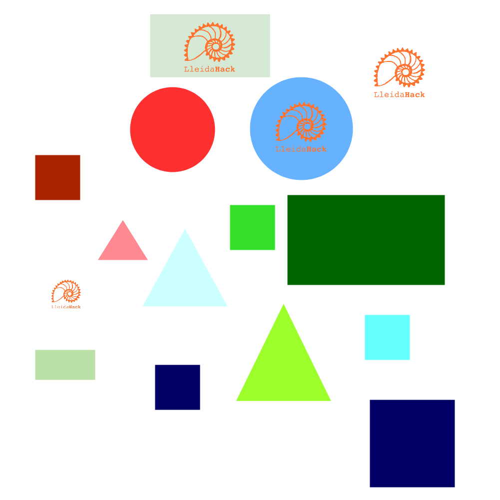

<h2 align = center>  </h2>
<h1 align="center">
   📍 &nbsp Instruccions per al 3r DailyHack &nbsp 📍
</h1>

# Quin és el repte? 🤔

Aquest tercer DailyHack consistirà en crear un programa capaç de classificar
les diferents figures d'una imatge segons forma i color. A banda de les figures, també caldrà identificar quants logos de LleidaHack apareixen.

## Formes 🖼

Les diferents formes que podem aparèixer són:

- Rectangle
- Cercle
- Quadrat
- Triangle

__Les figures poden tenir qualsevol mida!__

## Colors 🎨

En quant als colors, us demanarem que els classifiqueu segons:

- Vermell
- Blau
- Verd

Però __compte__, perquè __apareixeran diverses tonalitats de cadascun dels colors esmentats__, així que per exemple, haureu de considerar com a color
vermell tots els possibles derivats d'aquest (veient les imatges de referència s'entén millor).

# Material proporcionat 📦

Per tal de preparar el programa, en aquest repositori disposeu tant d'unes imatges de referència com d'unes de test.

## Imatges de referència 🔎

En les imatges de referència podreu veureu totes les possibles tonalitats que poden aparèixer de cada color, així com les diferents formes que s'hauran de classificar.

## Imatges de test 🧪

Les imatges de test us serviran per a realitzar proves del funcionament del vostre programa

# Que ha de fer el meu programa? 👨‍💻

El que es demana és un programa que rebi un arxiu `.png` com a argument, i com a sortida mostri tant el nombre de logos de LleidaHack que apareixen, com una classificació de les figures identificades segons forma i color.

## Exemple 🐍

Usant d'exemple la següent imatge:

<h2 align = center>  </h2>


S'esperaria que el resultat fos similar a:

```bash
$ python3 identificador_figures.py test4.png

Classificació:

----------- COLOR ------------

Vermelles:      3
Verdes:         5
Blaves:         5

----------- FORMES -----------

Triangles:      3
Quadrats:       4
Rectangles:     4
Cercles:        2

------ LOGOS LLEIDAHACK ------

Logos:          4


```

__PD__: Tot i que en l'exemple s'utilitza Python com a llenguatge, podeu utilitzar el llenguatge que vulgueu (tot i que Python pot resultar de gran utilitat degut a les eines que proporciona per aquest tipus de tasques)

# Com es decidirà el guanyador? 🏆

El guanyador serà qui presenti el programa amb major precisió. I per avaluar la precisió del que ens entregueu, usarem una sèrie d'imatges que no us proporcionarem fins que s'acabi el repte.

Aquestes imatges seran del estil de les que teniu a la carpeta `test-images`, concretament seran semblants a les imatges: `test1.png`, `test2.png` i `test3.png` (tot i que poden contenir un major nombre de figures).

# Entrega 🚚
Caldrà entregar el programa que hagueu desenvolupat, junt amb una molt breu documentació explicant com fer-lo funcionar. És important que detalleu com usar-lo ja que pot ser un impediment a l'hora d'avaluar.

# Informació útil 🐒
Us deixem alguns enllaços que poden resultar d'ajuda:

[OpenCV](https://opencv.org/)

[Image processing in Python](https://pythongeeks.org/image-processing-in-python/)

[How to classify figures by their shape and color](https://youtu.be/V-_O7nl0Ii0?t=17)
